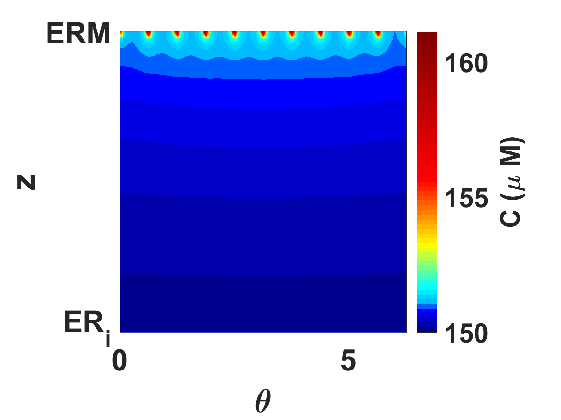
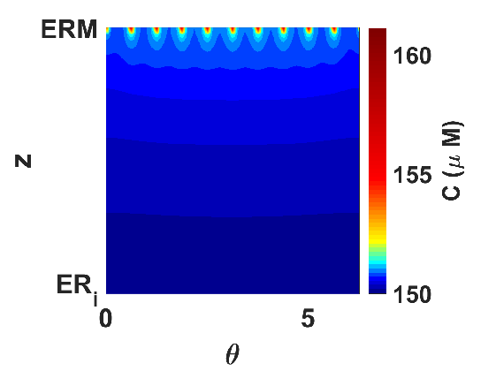
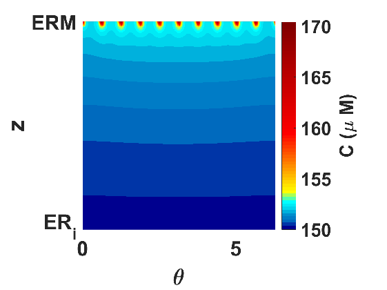
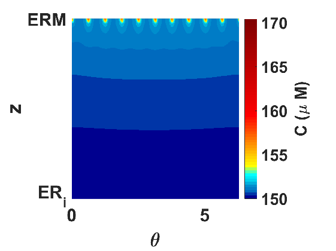

# Instructions for running code

This code was used to create plots of the simulated calcium profiles in the paper 'Three-dimensional spatio-temporal modelling of store operated Ca2+ entry: insights into ER refilling and the spatial signature of Ca2+ signals' available at <https://www.sciencedirect.com/science/article/pii/S0143416018300149>.

Below are the instructions for running the code, everything you need is within this folder. 
All instructions are run in a MATLAB session, and assume that the scripts are available in the working directory.
After the initial setup there are a selection of sample simulations, these are the simulations from the paper but are completely independent of each other so can be run individually to create the plots used to make the figures in the paper. The clustered Orai channel examples are the fastest to run, but they will still take a few days. 

The code is a prototype and as part of our subsequent work we intend to develop more user friendly software, for now if you have any problems or would like help please contact us. 
A word about memory usage: the code creates large matrices, ranging from 40GB to 105GB, for the Green's functions and the simulations are saved as four dimensional matrices, approximately 2GB in size; these are all held in memory. 

## Initial Setup

To compute the Green's functions and boundary solutions run the following twelve scripts. 

1. Create the Green's function in the ER-PM junction for the clustered Orai channels

    `run Greens_function_junction_clustered_orai.m`

2. Create the Green's function in the sub-PM ER for the clustered Orai channels

    `run Greens_function_S_clustered_orai.m`

3. Create the Green's function in the ER-PM junction for the non-clustered Orai channels

    `run Greens_function_junction_non_clustered_orai.m`

4. Create the Green's function in the sub-PM ER for the non-clustered Orai channels

    `run Greens_function_S_non_clustered_orai.m`

3. Create the boundary solutions in the ER-PM junction for the clustered Orai channels

    `run Boundary_soln_z_H_gaussian_21092017(30)`

4. Create the boundary solutions in the ER-PM junction for the non-clustered Orai channels

    `run Boundary_soln_z_H_gaussian_21092017(50)`

5. Create the boundary solutions in the ER-PM junction for the SERCA pumps 30nm from the clustered Orai channels

    `run Boundary_soln_z_L2_Gaussian_BC_04102017(60)`
    
6. Create the boundary solutions in the ER-PM junction for the SERCA pumps 30nm from the non-clustered Orai channels

    `run Boundary_soln_z_L2_Gaussian_BC_04102017(80)`

7. Create the boundary solutions in the ER-PM junction for the SERCA pumps 60nm from the clustered Orai channels

    `run Boundary_soln_z_L2_Gaussian_BC_04102017(90)`

8. Create the boundary solutions in the sub-PM ER for the SERCA pumps 30nm from the clustered Orai channels

    `run Boundary_soln_S_z_L2_Gaussian_04102017(60)`

9. Create the boundary solutions in the sub-PM ER for the SERCA pumps 30nm from the non-clustered Orai channels

    `run Boundary_soln_S_z_L2_Gaussian_04102017(80)`

10. Create the boundary solutions in the sub-PM ER for the SERCA pumps 60nm from the clustered Orai channels

    `run Boundary_soln_S_z_L2_Gaussian_04102017(90)`

## Example simulations

These are five separate independent example simulations. Each example can be run individually and will plot the relevant calcium profiles used to create the figures in the paper. 

### Clustered arrangement of Orai channels with SERCA2b pumps placed 30nm away

Edit the file

    SOCE_N150_run_all.m

by changing the following parameter values as shown and save your changes.

    distance_orai_SERCA=30;
    SERCA_choice=2;

This ensures the distance between the Orai channels and SERCA pumps is 30nm and ensures we use SERCA2b pumps in our simulations.

Execute the following command.

    run SOCE_N150_run_all.m

This will simulate SOCE and the calcium diffusion and ER refilling occurring in 1ms.

Execute the command

    run clustered_orai_d_30_SERCA2b.m

to plot the calcium profiles in Figures  3c, 3e, 5b, 6c. This also plots the calcium profiles in blue in Figure 4.

### Non-clustered arrangement of Orai channels with SERCA2b pumps placed 30nm away

Edit the file

    SOCE_N250_run_all.m

by changing the following parameter values as shown and save your changes.

    distance_orai_SERCA=30;
    SERCA_choice=2;

This ensures the distance between the Orai channels and SERCA pumps is 30nm and ensures we use SERCA2b pumps in our simulations.

Execute the following command.

    run SOCE_N250_run_all.m

This will simulate SOCE and the calcium diffusion and ER refilling occurring in 1ms.

Execute the command

    run non_clustered_orai_d_30_SERCA2b.m

to plot the calcium profiles in Figures  3d, 3f, 5c. This also plots the calcium profiles in red in Figure 4.

### Clustered arrangement of Orai channels with SERCA2b pumps placed 60nm away

Edit the file

    SOCE_N150_run_all.m

by changing the following parameter values as shown and save your changes.

    distance_orai_SERCA=60;
    SERCA_choice=2;

This ensures the distance between the Orai channels and SERCA pumps is 60nm and ensures we use SERCA2b pumps in our simulations.

Execute the following command.

    run SOCE_N150_run_all.m

This will simulate SOCE and the calcium diffusion and ER refilling occurring in 1ms.

Execute the command

    run clustered_orai_d_60_SERCA2b.m

to plot the calcium profile in Figure 6d.

### Clustered arrangement of Orai channels with SERCA2a pumps placed 30nm away

Edit the file

    SOCE_N150_run_all.m

by changing the following parameter values as shown and save your changes.

    distance_orai_SERCA=30;
    SERCA_choice=1;

This ensures the distance between the Orai channels and SERCA pumps is 30nm and ensures we use SERCA2a pumps in our simulations.

Execute the following command.

    run SOCE_N150_run_all.m

This will simulate SOCE and the calcium diffusion and ER refilling occurring in 1ms.

Execute the command

    run clustered_orai_d_30_SERCA2a.m

to plot the calcium profile in Figure 7a.

### Clustered arrangement of Orai channels with SERCA2a pumps placed 60nm away

Edit the file

    SOCE_N150_run_all.m

by changing the following parameter values as shown and save your changes.

    distance_orai_SERCA=60;
    SERCA_choice=1;

This ensures the distance between the Orai channels and SERCA pumps is 60nm and ensures we use SERCA2a pumps in our simulations.

Execute the following command.

    run SOCE_N150_run_all.m

This will simulate SOCE and the calcium diffusion and ER refilling occurring in 1ms. 

Execute the command

    run clustered_orai_d_60_SERCA2a.m

to plot the calcium profile in Figure 7b.

Execute the following command to create the plots of the SERCA activity in Figure 5(c) and 8

    run SERCA_transport_plots.m

